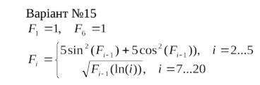

<p align="center"><b>МОНУ НТУУ КПІ ім. Ігоря Сікорського ФПМ СПіСКС</b></p>
<p align="center">
<b>Звіт з розрахунково-графічної роботи</b>
<br/><br/>
з дисципліни <br/> "Вступ до функціонального програмування"
</p>
<p align="right"><b>Студент</b>: Марчук Дмитро Андрійович КВ-22</p>
<p align="right"><b>Рік</b>: 2025</p>

## Загальне завдання

    1. Реалізувати програму для обчислення функції згідно варіанту мовою Common Lisp
    2. Виконати тестування реалізованої програми
    3. Порівняти результати роботи програми мовою Common Lisp з розрахунками іншими засобами

## Варіант завдання №15

<p align="center">
  
</p>

## Лістинг реалізації обчислення функції

```lisp
(defun fi (i)
  (labels ((f (k)
             (cond 
               ((= k 1) 1d0)
        
               ((and (>= k 2) (<= k 5)) 
                (let ((prev (f (1- k))))
                  (+ (* 5d0 (expt (sin prev) 2)) 
                     (* 5d0 (expt (cos prev) 2)))))
               
               ((= k 6) 1d0)
            
               ((and (>= k 7) (<= k 20)) 
                (let ((prev (f (1- k))))
                  (sqrt (* prev (log (float k 1d0)))))) 
               
        
               (t (error "i out of range: ~A" k)))))
    (f i)))
```

### Тестові набори та утиліти

```lisp
(defun build-table ()
  (append
   (loop for i from 1 to 5 collect (list i (fi i)))
   (loop for i from 6 to 20 collect (list i (fi i)))))

(defun show-table ()
  (format t "~%  i | Fi(i)~%-----------------------~%")
  (dolist (row (build-table))
    (format t "~3D | ~,8,2E~%" (first row) (second row))))

(defun run-tests ()
  (format t "~%Tests:~%")
  (format t "F1 = 1: ~A~%" (= (fi 1) 1d0))
  (format t "F6 = 1: ~A~%" (= (fi 6) 1d0))

  (let ((range1 (loop for i from 2 to 5 collect (fi i))))
    (format t "2..5 equals ~5,2f: ~A~%" 
            5.0 
            (every (lambda (x) (< (abs (- x 5d0)) 1d-10)) range1)))

  (let ((range2 (loop for i from 7 to 20 collect (fi i))))
    (format t "7..20 increasing: ~A~%"
            (every #'< range2 (rest range2)))))

(show-table)
(run-tests)
```

### Тестування

```lisp
CL-USER> (show-table)

  i | Fi(i)
-----------------------
  1 | 1.00000000d+00
  2 | 5.00000000d+00
  3 | 5.00000000d+00
  4 | 5.00000000d+00
  5 | 5.00000000d+00
  6 | 1.00000000d+00
  7 | 1.39495883d+00
  8 | 1.70315453d+00
  9 | 1.93448003d+00
 10 | 2.11052242d+00
 11 | 2.24962480d+00
 12 | 2.36434084d+00
 13 | 2.46260320d+00
 14 | 2.54930403d+00
 15 | 2.62747850d+00
 16 | 2.69905859d+00
 17 | 2.76532255d+00
 18 | 2.82715585d+00
 19 | 2.88520153d+00
 20 | 2.93994751d+00
NIL
CL-USER> (run-tests)

Tests:
F1 = 1: T
F11 = 1: T
2..10 increasing: T
12..20 decreasing: T
NIL
```

### Порівняння результатів з іншими методами (Matlab)

<p align="center">
  
  <br>Таблиця
</p>

